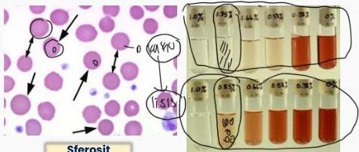

SFEROSITOSIS HEREDITER

# DEFINISI

- Sferositosis: berkurangnya membrane surface area terhadap volume cell
- Diturunkan secara autosomal dominan

# ETIOLOGI

- Mutasi genetik pada protein membran/sitoskeletal (spektrin) → instabilitas morfologi struktur RBC

# KLINIS

- 60% (tanda hemolitik) chronic anemia, jaundice dan splenomegaly

# TATALAKSANA

- Splenektomi

# PENUNJANG

- MDT → RBC sferosit
- Osmotic fragility test untuk mengukur ketahanan sel darah merah melalui osmotic stress yang dipicu oleh cairan hypotonic
- Pemeriksaan dilakukan dengan memasukkan eritrosit dalam beberapa konsentrasi salin (NaCl) → semakin cepat terjadinya hemolisis, semakin tinggi fragilitas RBC

Kelon Complete Batch Nov 2025

MEDIKO.ID

(Zamora, 2023) Hal. 1–8 (PAPDI, 2019) Hal. 462

3A