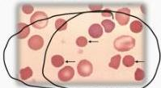
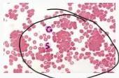

3

AUTOIMMUNE HEMOLYTIC ANEMIA (AIHA)

Wa(1)

|   | Warm (70%) | Cold (30%)  |
| --- | --- | --- |
|  Suhu optimal pengikatan RBC | 37°C (temperatur tubuh) | 0°C - 4°C  |
|  Etiologi | Idiopatik, sekunder (limfoma, CLL, SLE), obat-obatan (methyldopa) | Post infeksi (Mycoplasma, EBV, CMV), idiopatik  |
|  Klinis | Pada usia lebih muda: tanda hemolitik (+), demam, takikardi → kondisi lebih akut dan berat | Pada usia tua: tanda hemolitik (+), acrocyanosis, ulserasi kulit dan nekrosis  |
|  Dimediasi oleh autoantibodi | IgG | IgM  |
|  Mekanisme | Hemolisis ekstravaskuler | Hemolisis intravascular  |
|  Laboratorium | DAT: Komplemen IgG (+), C3 (+/-)
Smear spherocyte
Peningkatan LDH, bilirubin unkonjugasi dan total | DAT: Komplemen C3 (+)
Smear: aglutinasi
Peningkatan LDH, bilirubin unkonjugasi dan total  |

Spherocyte

Agglutination

# MEDIKOLOGIC

Yang Gendut selalu bikin
anget! (IgG → warm)

Minum Cold @a Worth mending Air Hangat
IgM Cold IgG Warm AIHA

Kelon Complete Batch Nov 2025

MEDIKO.ID

(PAPDI, 2019) Hal. 464-465

3A