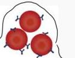
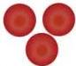
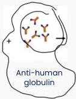
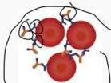
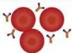
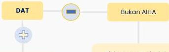

#

# AUTOIMMUNE HEMOLYTIC ANEMIA (AIHA)

Direct Coomb's Test

Dikenal juga sebagai **direct antiglobulin test** (DAT) → deteksi IgG/fraksi komplemen yang mengikat antigen RBC

RBC pasien yang dilapisi IgG atau C3

RBC pasien tidak dilapisi IgG atau C3

Anti-human globulin

Aglutinas (reaksi positif)

Tidak ada aglutinas (reaksi negatif)

Anemia hemolitik

DAT antiserum spesifik

Pikirkan penyebab lain hemolisis (toksin, obat, mekanik, kongenital)

IgG+, C3+

Warm AIHA

C3+

Cold AIHA

Ig lain

IgA/IgM mediated AIHA

Kelon Complete Batch Nov 2025

MEDIKO.ID

(PAPDI, 2019) Hal. 465

3A