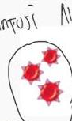
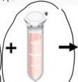
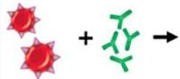
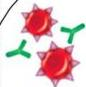
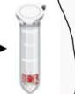
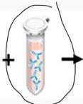
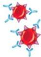
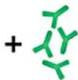
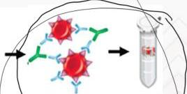

#

# AUTOIMMUNE HEMOLYTIC ANEMIA (AIHA)

## Indirect Coomb's Test

Dikenal juga sebagai **indirect antiglobulin test** (IAT) → deteksi antibody terhadap RBC pada serum

Digunakan untuk **crossmatch transfusi darah** dan pemeriksaan prenatal kehamilan

RBC dengan antigen minor

Serum pasien tanpa antibodi antigen minor

Tidak ada antibodi pasien yang terikat antigen RBC

Reagen Coomb's

Reaksi negatif

RBC dengan antigen minor

Serum pasien mengandung antibodi antigen minor

Antibodi pasien mengikat antigen RBC

Reagen Coomb's

Aglutinasi

Kelon Complete Batch Nov 2025

MEDIKO.ID

(Lancman, 2018) Hal. 1-8

3A