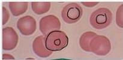
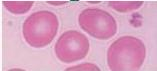

#

# MORFOLOGI ERITROSIT

## Normal Blood Film

Pink staining dengan eosin – central pallor 1/3 diameter RBC

Sel sirkuler bikonkat diameter rata-rata 7,0 µm (=rata-rata diameter limfosit kecil)

## Ukuran bervariasi ANISOCYTOSIS

## Sering co-existent

## MAKROSITOSIS

## MIKROSITOSIS

## ECHINOCYTES / BURR CELLS

(akibat perubahan lingkungan plasma)

Contoh : [uremia]

## SCHISTOCYTES

Fragmen RBC rosak akibat aliran darah (pembuluh darah abnormal atau prostesa jantung)

Kelon Complete Batch Nov 2025

MEDIKO.ID

(Henry, 2022) Hal. 591-593

4A

3A