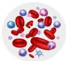
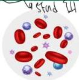

ANEMIA APLASTIK

SST

# DEFINISI

Penurunan produksi eritrosit, leukosit dan trombosit (pansitopenia) akibat kegagalan hematopoiesis primer di sumsum tulang

# ETIOLOGI

Benzene, radiasi, obat-obatan (chloramphenicol, antiepilepsi), PNH, pestisida (organoklorida, organofosfat, infeksi (EBV, hepatitis, HIV))

Normal

Aplastic Anaemia (fewer red cells, white cells, and platelets)

|  Lab | Klinis  |
| --- | --- |
|  Anemia | • Lemah, rasa lelah
• Pucat, pusing, jantung, berdebar-debar, dyspnea penglihatan kabur  |
|  Trombositopenia | • Perdarahan mukosa (perdarahan gusi, perdarahan vagina)
• Perdarahan di bawah kulit (ekimosis, ptekiae, purpura)  |
|  Leukopenia | • Rentan terhadap infeksi
• Demam, menggigil  |
|  Tidak ada limfadenopati dan organomegali  |   |

Kelon Complete Batch Nov 2025

MEDIKO.ID

(PAPDI, 2019) Hal. 451-453