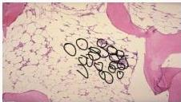
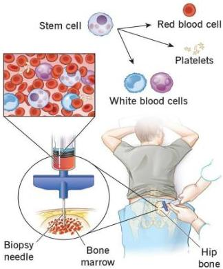

ANEMIA APLASTIK

# PENUNJANG

- DL → pansitopenia, retikulosit rendah (&lt;1%)
- **Gold standard**: biopsi sumsum tulang

# TATALAKSANA

- Transfusi komponen darah sesuai indikasi
- Prednison 1-2 mg/kgBB/hari
- Stimulan sumsum tulang: hormon androgen
- Terapi imunosupresif: Siklosporin, ATG
- Definitif: Marrow Transplantation

Gambaran hiposeluler, banyak terisi lemak, dan sedikit sel hematopoietik

Bone Marrow Donation

Kelon Complete Batch Nov 2025

MEDIKO.ID

(PAPDI, 2019) Hal. 451-453

(Onishi, 2024) Hal. 1-3