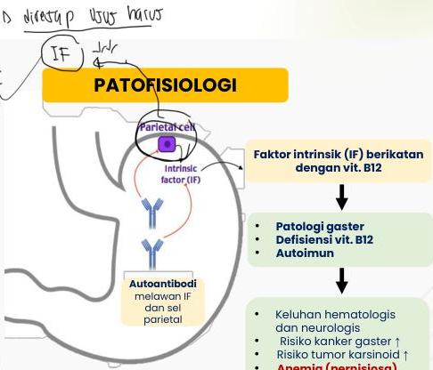

ANEMIA DEFISIENSI B12

# DEFINISI

- Anemia akibat defisiensi vitamin B12 (kobalamin)
- Fungsi B12: koenzim reaksi metilasi substrat (DNA, RNA, fosfolipid, protein) eritrosit

# ETIOLOGI

- Kurang intake (terutama makanan hewani): malnutrisi, vegetarian
- Kerusakan (gaster): defisiensi faktor intrinsik (anemia pernisiosa, gastrektom), ulkus gaster, Celiac disease
- Pankreatitis kronis
- Kerusakan atau reseksi ileum
- Infeksi parasite

Kompleks IF dan B12 diabsorbsi di ileum terminal

# PATOFISIOLOGI

- Parietal cell
- Intrinsic factor (IF)
- Autoantibodi melawan IF dan sel parietal

- Kattointrinsik (IF) berikatan dengan vit. B12
- Patologi gaster
- Defisiensi vit. B12
- Autoimun
- Keluhan hematologis dan neurologis
- Risiko kanker gaster ↑
- Risiko tumor karsinoid ↑
- Anemia (pernisiosa)

Kelon Complete Batch Nov 2025

MEDIKO.ID

(PAPDI, 2014) Hal. 2400 (Ankar, 2022) Hal. 1-6

3A