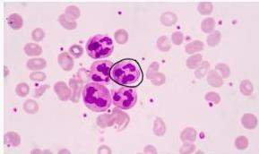

ANEMIA DEFISIENSI B12

Parco

# KLINIS

- Gejala umum anemia
- Hipertrofi gingiva, papilla
- **Gangguan neurologis**: neuropati perifer, glove stocking phenomenon, ataxia, gangguan kognitif/memori, psikosis, depresi

# PENUNJANG

- Di: Hb menurun MCV &gt; 100 fL
- MDT: Hipersegmentasi neutrophil (inti &gt;6)
- Uji Schilling (+) kadar serum vit B12 → gold standard
- MMA ↑, Homosistein ↑/N

# TATALAKSANA

- Vitamin B12 parenteral (IM) SC, 1 mg/hari selama 1 minggu
- Lanjut 1 mg/minggu selama 4 minggu → 1 mg/bulan.
- Sediaan oral (-) efektif apabila terdapat ggn absorpsi vit B12 di gastrointestinal

Hypersegmented neutrophils

Kelon Complete Batch Nov 2025

MEDIKO.ID

(PAPDI, 2014) Hal. 2402 (Ankar, 2022) Hal. 5

3A