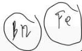

ANEMIA DEFISIENSI B9

# DEFINISI

Anemia karena defisiensi vitamin B9 (asam folat)

# ETIOLOGI

- Kurang intake, kurang sayur
- Kerusakan **hapur**: sirosis (hepatitis, alkohol, obat hepatotoksik: **MIX**, nitrous oksida, fenitoin, pirimetamin)
- Peningkatan kebutuhan: bayi, hamil, hemolisis
- Malabsorpsi kongenital
- Kerusakan duodenum dan **jejunum**

# DIAGNOSIS

*   Schilling test (-)

- Gejala anemia **tanpa gangguan neurologis**
- Pada bayi/kongenital: dapat disertai **neural tube defect**
- DL: Hb menurun, MCV &gt; 100 fL
- MDT: Hipersegmentasi neutrophil
- Kadar asam folat **menurun**
- MMA N, Homosistein ↑

# TATALAKSANA

- Asam folat **1-5 mg/hari** selama **1-4 bulan**
- Dosis 1 mg/hari sudah cukup efektif

Kelon Complete Batch Nov 2025

MEDIKO.ID

(PAPDI, 2014) Hal, 2402