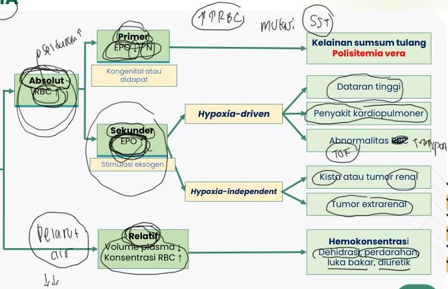

2

# POLISITEMIA

- Massa RBC &gt; 25%
- Pria Hb &gt; 16,5 g/dL atau Ht &gt; 49%
- Wanitat &gt; 16,0 g/dL atau Ht &gt; 48%

# POLISITEMIA

POLISITEMIA

- Massa RBC &gt; 25%
- Pria Hb &gt; 16,5 g/dL atau Ht &gt; 49%
- Wanitat &gt; 16,0 g/dL atau Ht &gt; 48%

Kelan Complete Batch Nov 2025

MEDIKO.ID

(AJH, 2024) Hal. 1468