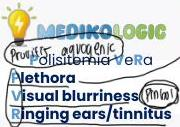
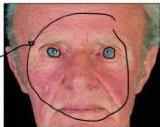

POLISITEMIA VERA

SST - MA

# DEFINISI

Keganasan myeloproliferatif akibat mutasi JAK2 yang menyebabkan hiperaktivitas eritropoiesis

# KRITERIA DIAGNOSIS

3 KRITERIA MAYOR
ATAU 2 KRITERIA MAYOR PERTAMA + KRITERIA MINOR

|  Kriteria Mayor | Kriteria Minor  |
| --- | --- |
|  1. Hb>16,5 g/dL atau Hct > 49% pada pria dan Hb> 16,0 g/dL pada atau Hct > 48% pada Wanita |   |
|  2. Biopsi sumsum tulang: hiperselularitas trilinier dengan proliferasi sel eritroia, granulositik, dan megakariosit yang dominan | Kadar eritropoietin darah yang menurun  |
|  3. Adanya mutasi JAK2V617F atau JAK2 ekson 12 |   |

# KLINIS

Gejala disebabkan hiperviskositas:
- Nyeri dada, palpitasi
- Nyeri kepala, lightheadedness
- Mudah lelah
- Gangguan penglihatan (kabur, skomata)

Spesifik untuk PV:
- Pruritus, paresthesia
- Telinga berdenging
- Superficial thrombophlebitis
- Eritromelalgia (ekstremitas terasa nyeri, panas, eritema, dan kulit hangat)

Plethora

Kelon Complete Batch Nov 2025

MEDIKO.ID

(AIH, 2024) Hal. 1466-1467