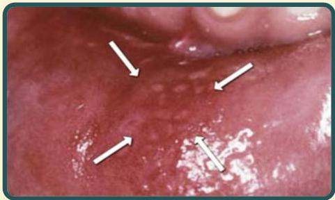

Atria.

# SAR herpetiform

Tampak ulkus multipel bergerombol pada mukosa labial

Lesi herpes terjadi pada kulit/mukosa berkeratin, sedangkan SAR herpetiform terjadi pada mukosa yang tidak berkeratin