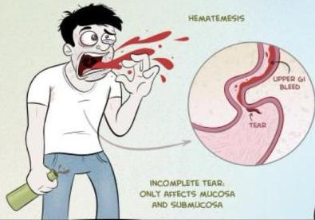
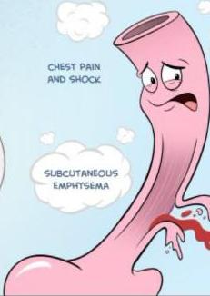

Atria.

# Sindrom Boerhaave vs Sindrom Mallory-Weiss

## MALLORY-WEISS SYNDROME

TEAR ON THE GASTRIC SIDE OF THE GASTROESOPHAGEAL JUNCTION, WHICH MAY EXTEND TO THE DISTAL ESOPHAGUS

## BOERHAAVE'S SYNDROME

CHEST PAIN AND SHOCK

SUBCUTANEOUS EMPHYSEMA

HAMMAN'S SIGN: CRUNCHING SOUND UPON AUSCULTATION OF THE HEART DUE TO PNEUMOMEDIASTINUM

COMPLETE RUPTURE AT THE LOWER THORACIC ESOPHAGUS

www.medcomic.com

© 2013 Jorge Muniz

Sumber Gambar: Medcomics