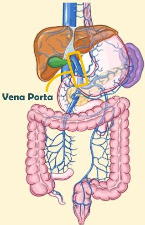

Atria.

# Anatomi Sistem Porta

Vena porta mengambil darah dari sistem gastrointestinal

Darah ini berisi:
- Nutrisi yang **diserap oleh usus**
- Toksin yang harus **dimetabolisme hepar** yang kemudian diekskresi ginjal

Setelah melewati hepar, darah ini akan masuk ke sistem perdarahan sistemik melalui **vena cava inferior**