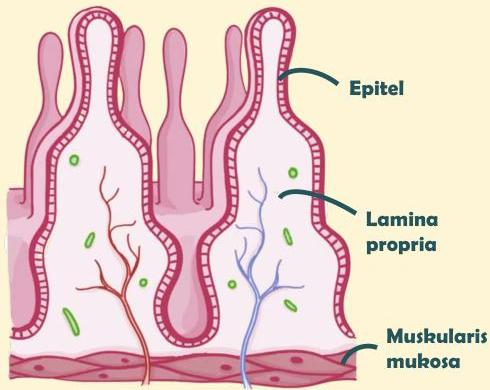

Atria.

# Anatomi Sederhana

Lapisan mukosa gaster terdiri atas beberapa lapisan:

- Epitel → untuk sekresi mukus dan enzim pencernaan
- Lamina propria → tempat terdapat pembuluh darah dan limfe
- Muskularis mukosa → pembatas lapisan mukosa dan submukosa