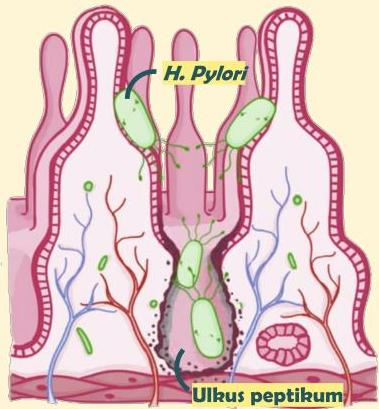

Atria.

# Ulkus Peptikum &amp; Duodenum

## Patofisiologi

- H. pylori menginfeksi epitel gaster dan duodenum dan menempel pada sel foveolar
- Bakteri ini juga menghasilkan protease yang dapat menyebabkan kerusakan pada mukosa