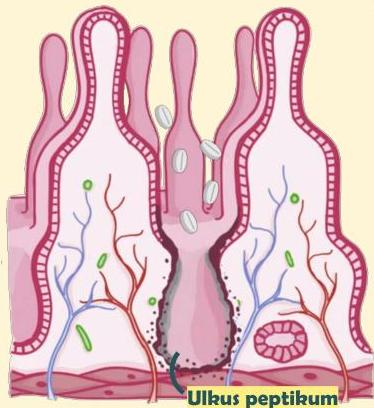
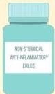

Atria.

# Ulkus Peptikum &amp; Duodenum

## Patofisiologi

- NSAID berfungsi dalam menghambat sintesis prostaglandin
- Berkurangnya prostaglandin dalam waktu lama dipercaya dapat merusak epitel dan menyebabkan ulkus