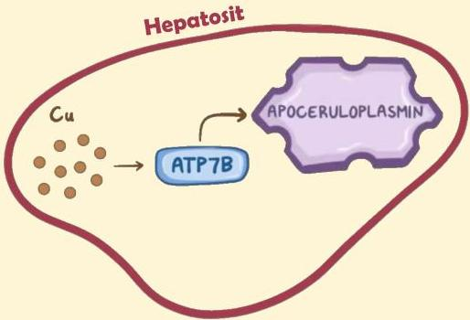

Atria.

# Penyakit Wilson

## Fisiologi Sederhana

- Di dalam hepatosit, ATP7B memiliki fungsi untuk mengikat kelebihan tembaga ke **aposeruloplasmin**
- Aposeruloplasmin yang telah berikatan dengan tembaga disebut **seruloplasmin**

