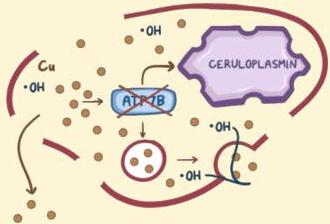

Atria.

# Penyakit Wilson

## Patofisiologi

- Pada penyakit Wilson, ATP7B tidak terbentuk sehingga tembaga terkumpul di dalam hepatosit
- Radikal bebas OH⁻ terbentuk sehingga menghancurkan hepatosit
- Akibatnya, tembaga dapat masuk ke peredaran darah dan merusak organ sekitar.

