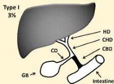
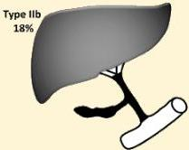
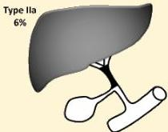
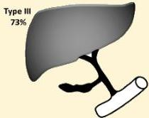

Atria.

# Atresia Bilier

## Klasifikasi Kasai:

- Tipe I: obliterasi duktus biliaris komunis (CBD)
- Tipe IIa: obliterasi duktus hepatikus komunis (CHD)
- Tipe IIb: obliterasi CHD, CBD, dan duktus sistikus (CD)
- Tipe III: obliterasi duktus hepatikus bilateral pada level porta hepatis

