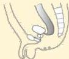
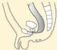
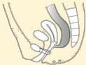
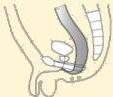
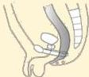
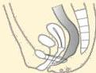
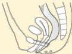
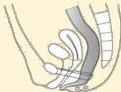
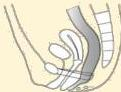

Atria.

High

Recto-vesical Fistula

Recto-prostatic Urethral Fistula

High

Recto-upper Vaginal Fistula

Intermediate

Recto-bulbar Urethral Fistula

Low

Anocutaneous Fistula

Recto-lower Vaginal Fistula

Recto-vestibular Fistula

Anovestibular Fistula

Anocutaneous Fistula

# Klasifikasi Wingspread

Berbagai jenis malformasi anorektal