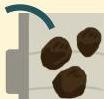
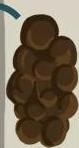
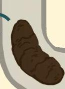
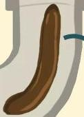
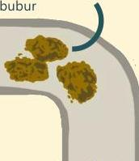
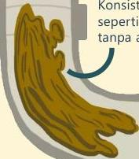

Atria.

# Bristol Stool Form Score

## Tipe 1 (konstipasi berat)

Terpisah-pisah dan keras seperti batu

## Tipe 2 (konstipasi)

Berbenjol-benjol namun tidak terpisah

## Tipe 3 (normal)

Bentuk sosis dengan garis-garis pada permukaannya

## Tipe 5 (kurang serat)

Gumpalan-gumpalan lembek

## Tipe 6 (diare)

Konsistensi seperti bubur

## Tipe 7 (diare berat)

Konsistensi seperti air, tanpa ampas

