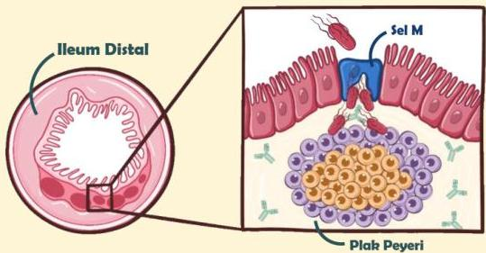

Atria.

# Demam Tifoid

## Patofisiologi

- S. typhi masuk ke dalam jaringan usus melalui sel M
- Sel ini kemudian mengeluarkan pathogen tersebut ke plak peyeri untuk dikenalkan ke antibodi
- Namun, S. typhi memiliki Polisakarida Vi pada kapsulnya sehingga ia dapat menghindari antibodi tersebut