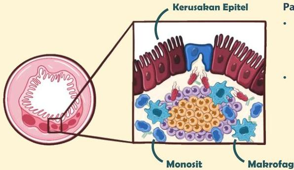

Atria.

# Demam Tifoid

## Patofisiologi

- Monosit dan makrofag kemudian berkumpul di area tersebut dan menyebabkan inflamasi
- Inflamasi ini merusak sel epitel usus dan dapat berpotensi menyebabkan perforasi usus