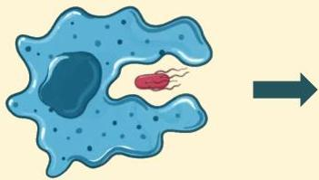
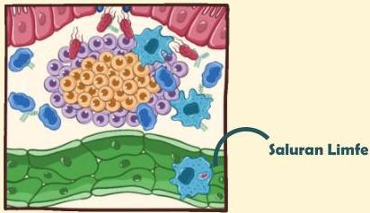

Atria.

# Demam Tifoid

Saluran Limfe

# Patofisiologi

- Makrofag memfagositosis S. typhi dan membawanya ke saluran limfatik
- Dari sini S. typhi dapat menyebar ke berbagai organ seperti limpa, hepar, vesica felea dan nodus limfatikus