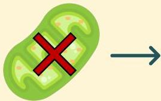
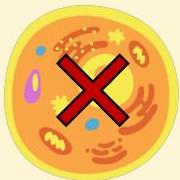

Atria.

# Sindrom Reye

## Patofisiologi

Kematian mitochondria menyebabkan sel tidak dapat memproduksi ATP dengan cukup

Hepatosit yang tidak memiliki cukup ATP akan mati

Bila banyak hepatosit mati, maka pasien akan mengalami gagal hepar