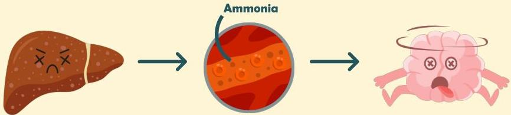

Atria.

# Sindrom Reye

## Patofisiologi

Hepar yang rusak tidak dapat memfiltrasi racun dalam darah termasuk ammonia

Ammonia kemudian menumpuk dalam darah dan menembus sawar darah otak

Tingginya ammonia pada otak akan menyebabkan manifestasi ensefalopati dan peningkatan TIK