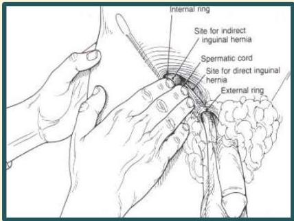

Atria.

# Tes Zieman

- Lokasi jari-2: cincin inguinalis profunda
- Lokasi jari-3: cincin inguinalis superfisialis
- Lokasi jari-4: Kanalis femoralis

Pasien diminta mengejan:

- Benjolan di jari-2 → hernia inguinalis lateralis
- Benjolan di jari-3 → hernia inguinalis medialis
- Benjolan di jari-4 → hernia femoralis