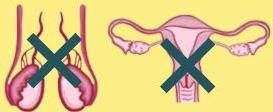

Atria.

# Hipogonadisme

## Hypergonadotropic Hypogonadism (Hipogonadisme primer)

### Etiologi

- **Genetik (Primer)**
- **Sindrom Turner**: Wanita, webbed neck, dada lebar, perawakan pendek
- **Sindrom Klinefelter**: Laki-laki, ginekomastia, perawakan tinggi

- **Sekunder**
- Kemoterapi
- Radiasi
- Infeksi (mis. mumps orchitis)

### Patofisiologi

Pada hipergonadotropik hipogonadisme, kelainan terletak pada gonad (alat kelamin) sehingga estrogen / testosterone rendah

Rendahnya hormon seks ini menyebabkan hilangnya feedback negatif sehingga LH dan FSH meningkat