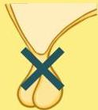

Atria.

# Hipogonadisme

## Hypogonadotropic Hypogonadism (Hipogonadisme sekunder)

### Etiologi

- Genetik (Primer)
- Sindrom Kallman: dicirikan dengan adanya anosmia
- Sindrom Prader-willi: dicirikan dengan perawakan pendek dan obesitas kanak-kanak
- Lesi hipofisis (mis. prolactinoma)
- Gangguan makan
- Penggunaan opioid

### Patofisiologi

Pada hipogonadotropik hipogonadisme, kelainan terletak pada hipofisis sehingga LH dan FSH rendah

Rendahnya hormon seks ini menyebabkan hilangnya rangsangan ke gonad sehingga estrogen / testosterone rendah