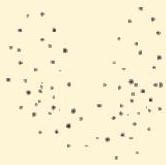

Atria.

# Hasil RAIU Scan

Normal

Penyakit Graves
Peningkatan uptake radio-iodin secara difus

Toxic Multinodular Goiter
Peningkatan uptake pada 2 lokasi di lobus kanan

Tiroiditis
Uptake radio-iodin yang lebih sedikit dari normal