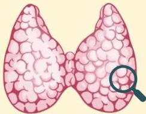

Atria.

# Anatomi Dasar

# Kelenjar Tiroid

Menghasilkan 2 hormon tiroid, yaitu:

- T3 (Triiodotironin)
- T4 (Tetraiodotironin / tiroksin)

Folikel mengandung banyak sel folikuler yang bertugas menghasilkan hormon tiroid yang disimpan dalam bentuk koloid

1 Folikel