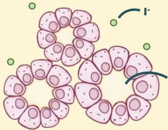

Atria.

# Pembentukan Hormon Tiroid

Sel folikuler membuat hormon tiroid dari bahan dasar iodin (I⁻)

I⁻ akan dibawa masuk ke koloid dan akan mengalami beberapa perubahan.

1. Oksidasi
Ion iodine akan diubah menjadi atom iodine oleh tiroid peroksidase (TPO)

2. Iodinisasi
Atom iodin menempel pada tiroglobulin dan membentuk monoiodotirosin (MIT) dan diiodotirosin (DIT)

3. Coupling
MIT dan DIT bergabung membentuk T₃ sedangkan DIT + DIT menghasilkan T₄ oleh tiroid peroksidase (TPO)