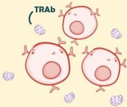
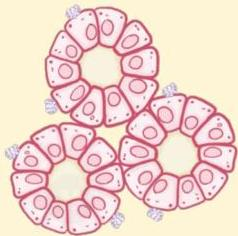
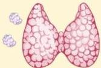
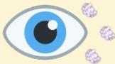

Atria.

# Patofisiologi Penyakit Graves

1. Sel B menghasilkan autoantibodi terhadap reseptor TSH

2. TRAb menempel pada folikel dan merangsang folikel menghasilkan hormon tiroid

3. Stimulasi folikel terus menerus menyebabkan sel folikel membesar → kelenjar tiroid membesar difus

4. Antibodi merangsang fibroblas di periorbita untuk menghasilkan glikosaminoglikan → mendorong mata keluar (eksoftalmos)