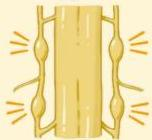

Atria.

# Fungsi Hormon Tiroid

## Sistem Kardiovaskular
Meningkatkan *heart rate* dan tekanan darah

## Sistem Tulang
Meningkatkan resorpsi tulang

## Sistem Saraf
Meningkatkan aktivitas saraf simpatis

## Fibroblas
Regulasi sintesis mukopolisakarida