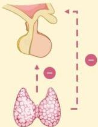

Atria.

# Hipotiroidisme

Definisi: Kumpulan penyakit yang disebabkan oleh rendahnya aktivitas hormon tiroid di dalam darah (kadar $T_{3}$ dan $T_{4}$ rendah)

Klasifikasi

|  Jenis | Organ yang Bermasalah | Abnormalitas Hormon  |
| --- | --- | --- |
|  Hipotiroidisme primer | Kelenjar tiroid | T3 dan T4 rendah, TSH tinggi (akibat hilangnya feedback negatif)  |
|  Hipotiroidisme sentral  |   |   |
|  Hipotiroidisme sekunder | Hipofisis anterior | T3 dan T4 rendah, TSH rendah  |
|  Hipotiroidisme tersier | Hipotalamus | T3 dan T4 rendah, TSH rendah  |

