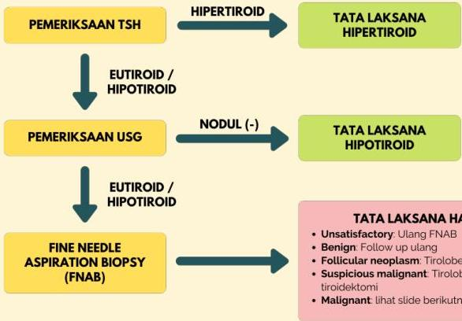

Atria.

# Algoritma Sederhana Nodul Tiroid

PEMERIKSAAN TSH

HIPERTIROID

TATA LAKSANA HIPERTIROID

EUTIROID / HIPOTIROID

PEMERIKSAAN USG

NODUL (-)

TATA LAKSANA HIPOTIROID

EUTIROID / HIPOTIROID

FINE NEEDLE ASPIRATION BIOPSY (FNAB)

TATA LAKSANA HASIL FNAB

- Unsatisfactory: Ulang FNAB
- Benign: Follow up ulang
- Follicular neoplasm: Tirolobektomi
- Suspicious malignant: Tirolobektomi / Near-total tiroidektomi
- Malignant: lihat slide berikutnya