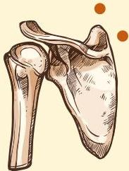
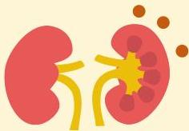
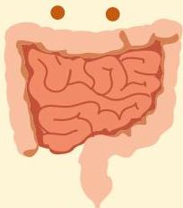

Atria.

# Fisiologi Dasar

## Sistem Tulang

PTH akan meningkatkan resorpsi tulang untuk meningkatkan kadar kalsium

## Ginjal

PTH akan meningkatkan resorpsi kalsium, mengekskresi fosfat dan menghasilkan kalsitriol

## Usus

PTH akan meningkatkan penyerapan kalsium di usus akibat aktivasi kalsitriol