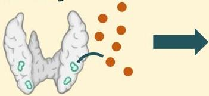
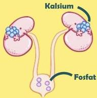
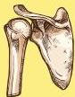
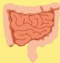

Atria.

# Hiperparatiroidisme Primer

## Patofisiologi

Pada hiperparatiroidisme primer, sel chief tetap menghasilkan PTH tanpa peduli kadar Ca++ dalam darah

## Hiperkalsemia dan Hipofosfatemia

- Akibatnya ginjal akan meningkatkan reabsorbsi kalsium secara berlebihan sambil tetap mengekskresi fosfat
- Tulang akan memulai proses reabsorpsi untuk meningkatkan kadar kalsium
- Usus akan meningkatkan absorbsi kalsium