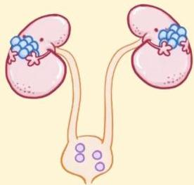

Atria.

# Hiperparatiroidisme Primer

Patofisiologi

Namun, **saking banyaknya kalsium** dalam darah akibat proses osteolitik tulang, kalsium tetap menumpuk dalam urin dan dapat menyebabkan hiperkalsiuria → meningkatkan risiko nefrolitiasis