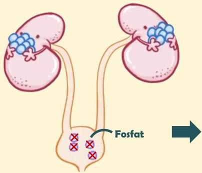
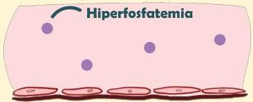

Atria.

# Hiperparatiroidisme Sekunder

Patofisiologi

Pada hiperparatiroidisme sekunder, ginjal mengalami gangguan sehingga tidak mengekskresi fosfat dengan baik

Keadaan ini menyebabkan fosfat terakumulasi di darah → hiperfosfatemia

