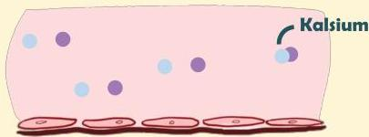
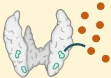

Atria.

# Hiperparatiroidisme Sekunder

## Patofisiologi

Ca²⁺ akan mengikat fosfat
dan membentuk kalsium
fosfat sehingga
menyebabkan penurunan
kadar Ca²⁺ → hipokalsemia

Keadaan hipokalsemia ini akan
merangsang kelenjar paratiroid untuk
menghasilkan PTH → hiperparatiroidisme