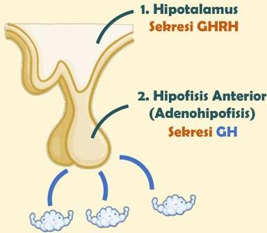

Atria.

# Fisiologi Sederhana

Growth hormone (GH)
merupakan hormone pertumbuhan yang dihasilkan oleh pituitari anterior

Hipotalamus mengatur sekresi GH dengan menghasilkan GHRH

Sumber Gambar: Osmosis.org