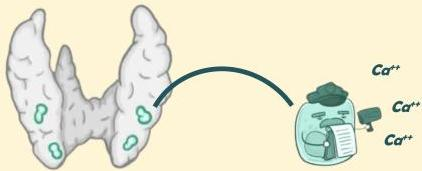
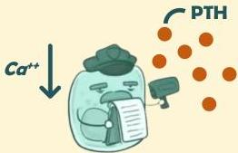

Atria.

# Fisiologi Dasar

## Kelenjar Paratiroid

Terdapat 4 kelenjar paratiroid yang berada di sisi posterior kelenjar tiroid

## Chief Cells

Kelenjar ini memiliki chief cells yang berfungsi memeriksa kadar kalsium dalam darah

Pada keadaan kalsium darah yang rendah, chief cells akan menghasilkan hormon paratiroid (PTH)