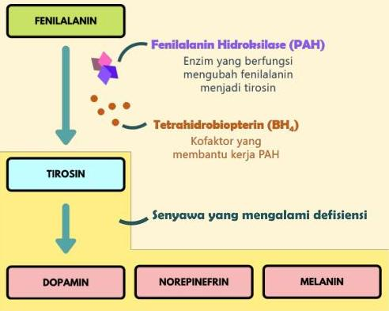

Atria.

# Fenilketonuria

## Patofisiologi

- Gangguan pada enzim maupun kofaktor menyebabkan **defisiensi pada tirosin**
- Karena tirosin berperan pada pembentukan dopamin dan norepinefrin yang merupakan neurotransmitter, maka dapat terjadi gangguan perkembangan otak pada kasus ini
- Melanin yang mengalami defisiensi juga akan menyebabkan manifestasi mata biru dan kulit putih/pucat