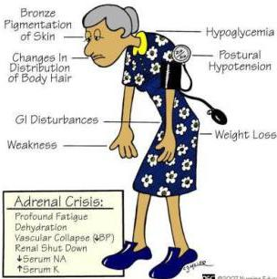

Atria.

# ADDISON'S DISEASE

Bronze
Pigmentation
of Skin
Changes In
Distribution
of Body Hair
GI Disturbances
Weakness
Hypoglycemia
Postural
Hypotension
Weight Loss

©2007 Nursing Education Consult

# Gejala pada penyakit Addison