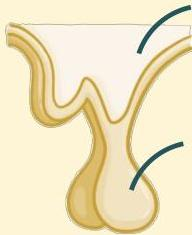
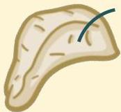

Atria.

# Aksis HPA

Sekresi kortisol melibatkan 3 organ, yaitu:

- Hipotalamus: menghasilkan CRH (Corticotropin releasing hormone)
- Hipofisis anterior: menghasilkan ACTH (Adrenocorticotropin hormone)
- Adrenal: menghasilkan kortisol

1. Hipotalamus
Sekresi CRH

2. Hipofisis Anterior (Adenohipofisis)
Sekresi ACTH

3. Korteks Adrenal (Zona Fasikulata)
Sekresi Kortisol

Sumber Gambar: Osmosis.org