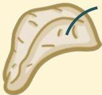

Atria.

Sekresi CRH

Sekresi ACTH

Kortisol memberikan feedback negatif ke hipotalamus dan hipofisis

# Feedback Negatif

Tubuh meregulasi
sekresi kortisol
dengan menurunkan
kadar ACTH dan CRH

Sumber Gambar: Osmosis.org