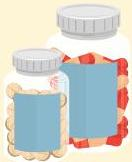

Atria.

# Sindrom Cushing Eksogen

- Akibat penggunaan kortikosteroid jangka panjang
- Glukokortikoid oral → pada penyakit autoimun
- Glukokortikoid inhalasi → pada penyakit asma
- Karena diagnosis ini merupakan hiperkortisolisme eksogen, maka tidak ada gangguan aksis HPA
- Tidak membutuhkan pemeriksaan penunjang lebih lanjut

